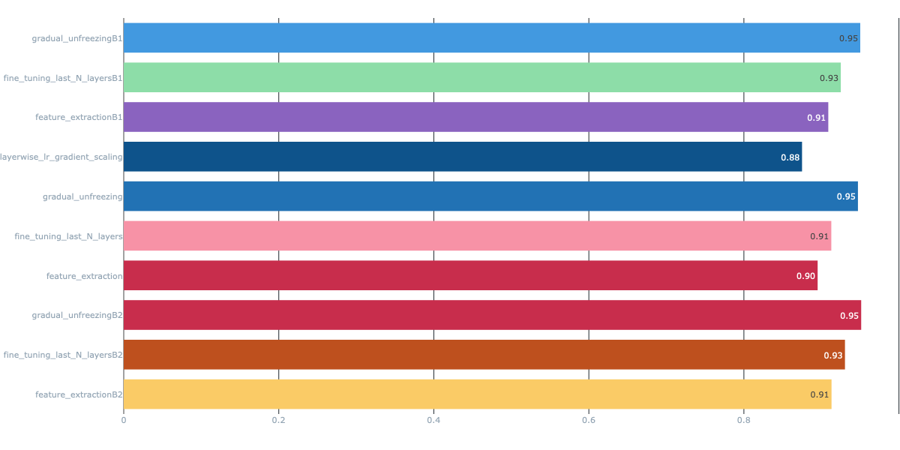
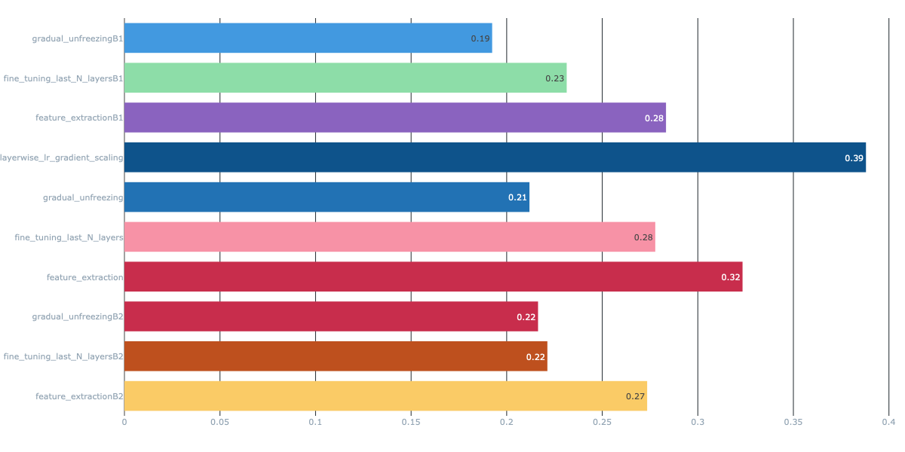

# Food-11 Image Classification with Transfer Learning

## Project Overview

This project applies **Transfer Learning** using **EfficientNet** (B0, B1, B2) to classify food images into 11 categories using the Food-11 dataset from Kaggle. Multiple transfer learning strategies were compared, all tracked with **MLflow** on **DAGsHub**.

## Environment

| Component | Version |
|-----------|---------|
| TensorFlow | 2.19.0 |
| Keras | 3.13.2 |
| GPU | NVIDIA A100 (Google Colab) |
| Batch Size | 32 |

## Dataset

| Split | Images |
|-------|--------|
| Training | 9,866 |
| Validation | 3,430 |
| Test | 3,347 |
| Classes | 11 (Bread, Dairy product, Dessert, Egg, Fried food, Meat, Noodles-Pasta, Rice, Seafood, Soup, Vegetable-Fruit) |

Preprocessing: Data augmentation (random horizontal flip, rotation ±36°, zoom ±10%), pipeline optimized with `cache()`, `shuffle()`, and `prefetch()`.

---

## Experiment Summary (EfficientNetB0)

| Strategy | Accuracy | Loss | F1 | Epochs |
|----------|:---:|:---:|:---:|:---:|
| Feature Extraction | 89.51% | 0.3234 | 0.89 | 10 |
| Fine-tuning (Last 20) | 91.28% | 0.2777 | 0.91 | 20 |
| **Gradual Unfreezing** | **94.71%** | **0.2119** | **0.95** | **40** |
| Layer-wise LR Decay | 87.50% | 0.3879 | 0.87 | 12 (early stop) |

---

## Strategy Details

### 1. Feature Extraction
- Froze entire EfficientNet backbone, trained only the classification head
- Head: GlobalAveragePooling2D → Dropout(0.2) → Dense(11, softmax)
- Optimizer: Adam (LR = 1e-3)

### 2. Fine-tuning (Last N Layers)
- Continued from Feature Extraction model (head already trained)
- Unfroze last 20 layers, kept BatchNorm frozen
- Optimizer: Adam (LR = 1e-5)

### 3. Gradual Unfreezing
- New model, unfroze one block at a time: top → block7 → ... → block1
- 5 epochs per block, LR decayed by 0.7× after each block
- BatchNorm frozen throughout

### 4. Layer-wise LR Decay (Gradient Scaling)
- All layers open from epoch 1, single Adam optimizer
- Each block's gradients scaled by a decay factor (head ×1.0, top ×0.5, block7 ×0.25, ... stem ×0.002)
- Deeper layers learn slower without needing multiple optimizers

---

## Observations

### Feature Extraction vs Fine-tuning

Feature Extraction achieved 89.51% (F1=0.89) by training only 14K parameters, while Fine-tuning reached 91.28% (F1=0.91) with 1.3M trainable parameters. The +1.77% improvement confirms that adapting the backbone's higher-level features to food patterns provides meaningful gains. The key was using a 100× smaller learning rate (1e-5 vs 1e-3) to avoid destroying pretrained weights.

### Convergence

- **Feature Extraction** converged fastest, accuracy jumped from 73% to 83% in just 2 epochs
- **Fine-tuning** showed steady improvement across all 10 additional epochs without triggering EarlyStopping
- **Gradual Unfreezing** had the longest training (40 epochs) but biggest gains came from the first 15 epochs. Later blocks showed diminishing returns
- **Layer-wise LR** converged poorly , validation accuracy fluctuated and EarlyStopping triggered at epoch 12

### Generalization

| Strategy | Train Acc | Val Acc | Gap |
|----------|:---:|:---:|:---:|
| Feature Extraction | ~89% | ~88% | ~1% (excellent) |
| Fine-tuning | ~92% | ~89% | ~3% (good) |
| Gradual Unfreezing | ~99% | ~92% | ~7% (moderate) |
| Layer-wise LR | ~91% | ~81% | ~10% (poor) |

Feature Extraction generalized best (smallest gap) due to limited trainable capacity. Gradual Unfreezing had the largest gap but still achieved the best test accuracy (94.71%, F1=0.95), meaning the overfitting did not prevent strong generalization.

### Overfitting

- **Feature Extraction**: Minimal , frozen backbone acts as a strong regularizer
- **Fine-tuning**: Mild , more trainable params but controlled by small LR
- **Gradual Unfreezing**: Moderate in later blocks (train ~99%, val ~92%). Could be reduced with stronger augmentation or higher dropout
- **Layer-wise LR**: Severe instability , all layers open too early caused noisy optimization

---

## Per-Class Metrics (F1/Precision/Recall)

All three notebooks (B0, B1, B2) include full `classification_report` for every strategy.

**Key findings across all models:**
- **Hardest class:** Dairy product , F1 ranged from 0.77 (B0 FE) to 0.91 (B0/B1 GU). Visually diverse category (milk, cheese, yogurt, butter) often confused with Dessert and Egg
- **Easiest class:** Noodles-Pasta , F1 ≥ 0.98 across all strategies and models. Very distinct visual pattern
- **Most improved:** Dairy gained the most from Gradual Unfreezing (+0.14 F1 in B0), confirming progressive training helps the weakest categories most

---

## EfficientNet Model Comparisons
All three notebooks use the exact same code, strategies, and hyperparameters the only difference is the model backbone. EfficientNet scales three things between versions:

| | B0 | B1 | B2 |
|--|:--:|:--:|:--:|
| Image size | 224×224 | 240×240 | 260×260 |
| Parameters | 4M | 6.5M | 7.8M |
| Width multiplier | 1.0× | 1.0× | 1.1× |
| Depth (layers) | 238 | 340 | 340 |

B1 adds more layers (deeper). B2 keeps the same depth as B1 but widens each layer (more filters). Bigger model = better features but slower training.

| Strategy | B0 | B1 | B2 |
|----------|:---:|:---:|:---:|
| Feature Extraction | 89.51% | 90.89% | **91.31%** |
| Fine-tuning | 91.28% | 92.50% | **93.04%** |
| Gradual Unfreezing | 94.71% | 95.01% | **95.13%** |

Larger models help most with frozen backbones (FE: B2 beats B0 by +1.80%). With Gradual Unfreezing, all three converge to ~95% , the training strategy matters more than model size.

---

## Experiment Tracking

- **DAGsHub**: Dataset uploaded at `ahad-m/my-first-repo`
- **MLflow**: All runs tracked with:
  - Parameters: model name, strategy, LR, epochs, batch size, dropout
  - Metrics: train/val loss and accuracy per epoch, test loss, accuracy, F1
  - Artifacts: training curve plots, comparison charts
  - Models: saved with `mlflow.keras.log_model()`

## MLflow Results Overview

### Test Accuracy — All Experiments

Gradual Unfreezing achieved the highest accuracy across all models (B0: 95%, B1: 95%, B2: 95%), while Layer-wise LR Decay was the weakest (88%). Larger models (B1, B2) consistently outperformed B0 in Feature Extraction and Fine-tuning.

### Test Loss — All Experiments

Gradual Unfreezing B1 achieved the lowest loss (0.19), followed by B0 (0.21) and B2 (0.22). Layer-wise LR had the highest loss (0.39), confirming its optimization instability.

All experiments are versioned and comparable on the [DAGsHub MLflow dashboard](https://dagshub.com/ahad-m/my-first-repo.mlflow).
